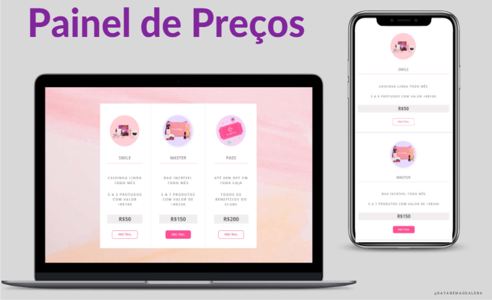
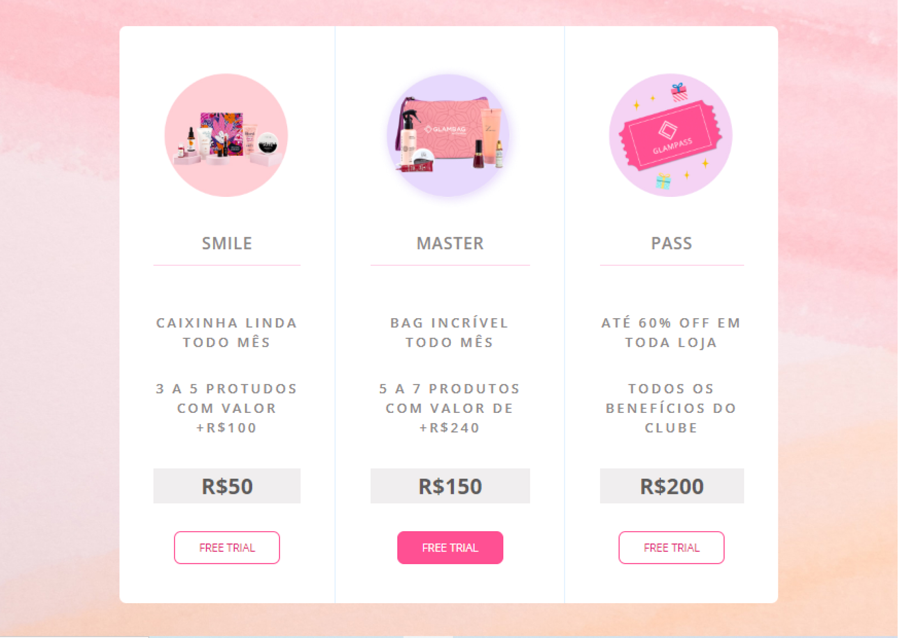
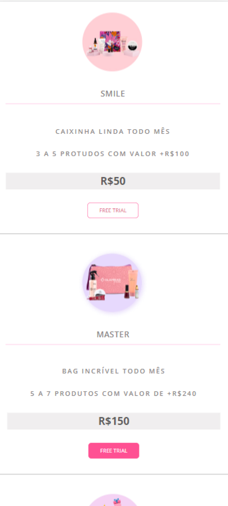

<h1 align="center"> Painel de Preços </h1>
<h3 align="center"> Estudo sobre <b>responsividade</b> </h3>

&nbsp;&nbsp;&nbsp;|&nbsp;&nbsp;&nbsp; <a href="#sobre">Sobre</a> &nbsp;&nbsp;&nbsp;|&nbsp;&nbsp;&nbsp;
<a href="#tecnologias-utilizadas">Tecnologias Utilizadas</a> &nbsp;&nbsp;&nbsp;|&nbsp;&nbsp;&nbsp;
<a href="#layout">Layout</a> &nbsp;&nbsp;&nbsp;|&nbsp;&nbsp;&nbsp;
 

 

  

<h4 align="center"> 
	 Status: Finalizado
</h4>

## Sobre
 

Trata-se de um estudo sobre <b>responsividade</b> realizado após as aulas sobre o mesmo tema no Bootcamp Web Developer da Udemy.  
A partir deste estudo pude botar em prática o conhecimento adquirido sobre Media Queries e demais recursos do CSS.
Usei como inspiração o programa de assinatura da [Glambox](https://glambox.com.br/clube?plans=1).

- [Acesse o projeto finalizado, online](https://rayanemagdalena.github.io/painel_de_pre-os/)

---

## Tecnologias Utilizadas
 

-  HTML

-  CSS

-  GIT

-  GitHub

-  Figma
 

---

## Layout

Layout - Desktop

Layout - Mobile     

---

